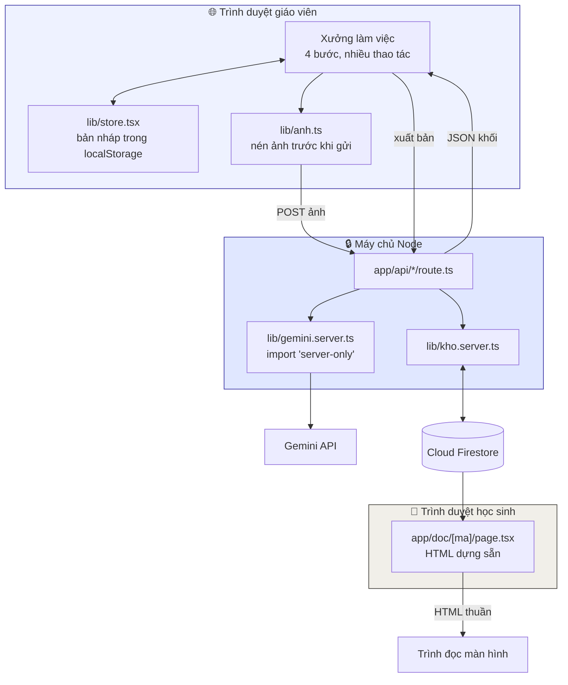

# Kiến trúc

Verso là ứng dụng **Next.js 16 (App Router)**, chia làm hai mặt rất khác nhau:

- **Mặt giáo viên** — ứng dụng client nhiều thao tác, chạy trên máy tính, giữ bản nháp trong máy
- **Mặt học sinh** — trang HTML **dựng sẵn ở máy chủ**, tối giản, đọc được không cần JavaScript

Hai mặt này có yêu cầu ngược nhau, nên được xây bằng hai cách khác nhau. Đó là quyết định
kiến trúc quan trọng nhất của dự án.

---

## Vì sao trang học sinh phải dựng ở máy chủ

Học sinh khiếm thị Việt Nam thường dùng **máy cũ, mạng yếu**, và trình đọc màn hình
(NVDA, VoiceOver, TalkBack) đọc **cây DOM**.

Nếu trang được dựng bằng JavaScript ở phía trình duyệt, trình đọc màn hình phải chờ:
tải JS → chạy JS → dựng DOM → mới có gì để đọc. Trên máy yếu, đó là vài giây im lặng
mà người dùng không biết chuyện gì đang xảy ra.

Trang dựng sẵn ở máy chủ thì **HTML về là đọc được ngay**. Đây là lập luận về khả năng
tiếp cận, không phải về tốc độ.

```
app/doc/[ma]/page.tsx      ← KHÔNG có 'use client'
components/KhoiDoc.tsx     ← KHÔNG có 'use client'
```

Hệ quả: `KhoiDoc` không được dùng `useState`, `onClick`, hay bất cứ thứ gì cần trình duyệt.
Đó là ràng buộc có chủ đích.

---

## Ranh giới client / máy chủ



Ba bất biến:

1. **Khoá API không bao giờ vào trình duyệt.** `lib/gemini.server.ts` mở đầu bằng
   `import 'server-only'` — lỡ import vào component client là build hỏng ngay.
2. **Client không chạm Firestore.** Luật bảo mật đặt `allow read, write: if false`;
   Admin SDK đi vòng qua luật, nên mọi thao tác ghi đều qua route của ta.
3. **Ảnh scan gốc không lên máy chủ.** Xem [SAFETY](#) — chỉ nội dung đã chuyển dạng
   được lưu, đúng phạm vi Điều 25a.

### Trên Cloud Run không có khoá nào cả

Cloud Run chạy trong cùng project với Firestore, nên dịch vụ tự có danh tính của chính nó:

```ts
EMAIL && KHOA
  ? { credential: cert({ ... }) }          // máy cá nhân — cần khoá service account
  : { credential: applicationDefault() }   // Cloud Run — không cần gì cả
```

Không có file khoá trên máy chủ thì cũng không có gì để rò rỉ.

---

## Mô hình dữ liệu: Khối là đơn vị trung tâm

```
BanVerso  →  Trang[]  →  Khoi[]
```

**Khối** là một mảnh nội dung biết mình là loại gì. Đây là điểm khác biệt so với OCR:
OCR trả về một khối chữ; Verso trả về những mảnh có **ngữ nghĩa**.

| Loại khối | Vì sao cần tách riêng |
|---|---|
| `tieu-de` | Thành `<h2>`/`<h3>` → học sinh nhảy theo cấp tiêu đề |
| `van-ban` | Đoạn văn xuôi thường |
| `tho` | Phải giữ nguyên từng dòng và khoảng cách khổ, không được gộp |
| `hinh-anh` | Mô tả là **nội dung thật**, không phải thuộc tính `alt` |
| `cong-thuc` | Có hai dạng: ký hiệu cho mắt, lời đọc cho tai |
| `bang` | Duỗi theo hàng, mỗi ô gắn với tên cột |
| `bai-tap` | Có `soBaiTap` → mốc nhảy nhanh khi thầy cô giao bài |
| `chu-thich` | Gắn `thuocVe` = từ được giải nghĩa, đặt ngay sau đoạn chứa từ đó |
| `khung-luu-y` | Hộp "Ghi nhớ", "Em có biết" |

### Ba trường sinh ra từ việc thử với sách thật

```ts
Khoi {
  docThanhLoi?: string   // công thức đứng riêng → "x bình phương cộng hai x…"
  vanBanDoc?:   string   // công thức XEN TRONG câu → cả câu ở dạng đọc được
  bang.hangDoc?: string[][]  // ô bảng có ký hiệu → dạng đọc từng ô
}
```

`vanBanDoc` là trường tôi không nghĩ ra khi thiết kế. Nó chỉ lộ ra khi thử với trang 82
SGK Toán 9 thật: đề bài viết *"chứng minh rằng sin²α + cos²α = 1"* — công thức nằm **giữa
câu văn**. Tách ra thành khối riêng thì vỡ mạch đọc; để nguyên thì trình đọc màn hình đọc
thành rác. Giải pháp: giữ nguyên câu cho mắt, kèm bản đọc thành lời cho tai.

### Cờ độ tin cậy

Mỗi khối mang `doTinCay: 'cao' | 'trung-binh' | 'thap'` do chính model tự đánh giá, kèm
`ghiChu` nói rõ chỗ nào chưa chắc. Đây là đầu vào cho cổng duyệt — xem
[LUONG-CHAY.md](LUONG-CHAY.md).

---

## Cây thư mục

```
app/
  page.tsx              xưởng làm việc giáo viên (client)
  doc/[ma]/page.tsx     trang học sinh đọc (SERVER — không 'use client')
  thu-vien/page.tsx     thư viện dùng chung (server)
  globals.css           bảng thiết kế + tiện ích tiếp cận
  api/
    doc-trang/          đọc một trang sách
    xuat-ban/           xuất bản, có cổng duyệt

lib/
  prompt.ts             9 nguyên tắc + hướng dẫn riêng 9 môn   ← linh hồn sản phẩm
  gemini.server.ts      schema, thử lại có lùi dần, model dự phòng
  kho.server.ts         Firestore, mã chia sẻ, thư viện
  firebase.server.ts    Admin SDK, cache qua globalThis
  chuanHoa.ts           kết quả thô → khối dùng được
  types.ts              mô hình Khối
  store.tsx             trạng thái client, bản nháp localStorage
  anh.ts                nén ảnh phía trình duyệt
  route-helper.ts       ánh xạ lỗi model → mã lỗi client hiểu được
  loi.ts                mã lỗi → câu tiếng Việt

components/
  KhoiDoc.tsx           bộ dựng khối tiếp cận được  ← quyết định screen reader nghe gì
  XuongLam.tsx          vỏ 4 bước
  Buoc*.tsx             từng bước
  ui.tsx                nút, thẻ, ô nhập, thanh tiến độ
```

---

## Ba cái bẫy đã vấp phải

**Firestore không cho mảng lồng mảng.** Bảng là `string[][]` → `INVALID_ARGUMENT`. Thay vì
bẻ cong mô hình dữ liệu cho vừa hạ tầng, gói nội dung thành chuỗi JSON **ở đúng tầng lưu
trữ**, kèm chốt chặn 900KB.

**Biến module không sống sót qua ranh giới Next.js.** Server Component và Route Handler nạp
ở hai không gian module khác nhau, nên cache Firestore rỗng ở nơi thứ hai trong khi Firebase
app đã tồn tại → `settings() called twice` → 500 ngẫu nhiên. Phải cache qua `globalThis`.

**Cloud Run không tự đặt `GOOGLE_CLOUD_PROJECT`.** Chỉ đặt `K_SERVICE`. Dùng nhầm biến thì
Firestore im lặng trả rỗng — thư viện 0 bản, mọi link 404, không có lỗi nào cả. Đây là kiểu
lỗi tệ nhất: hỏng mà không kêu.

---

## Đọc tiếp

- [LUONG-CHAY.md](LUONG-CHAY.md) — từ ảnh trang sách tới tai học sinh
- [ACCESSIBILITY.md](ACCESSIBILITY.md) — kỹ thuật tiếp cận, phần quyết định chất lượng
- [AI-INTEGRATION.md](AI-INTEGRATION.md) — prompt, schema, 9 môn học
- [DEPLOYMENT.md](DEPLOYMENT.md) — chạy, triển khai, xử lý sự cố

---

Xem thêm: [Xuất file EPUB 3 / DAISY 3](XUAT-FILE.md)
