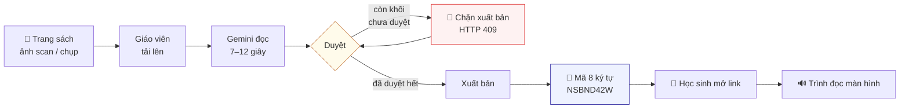
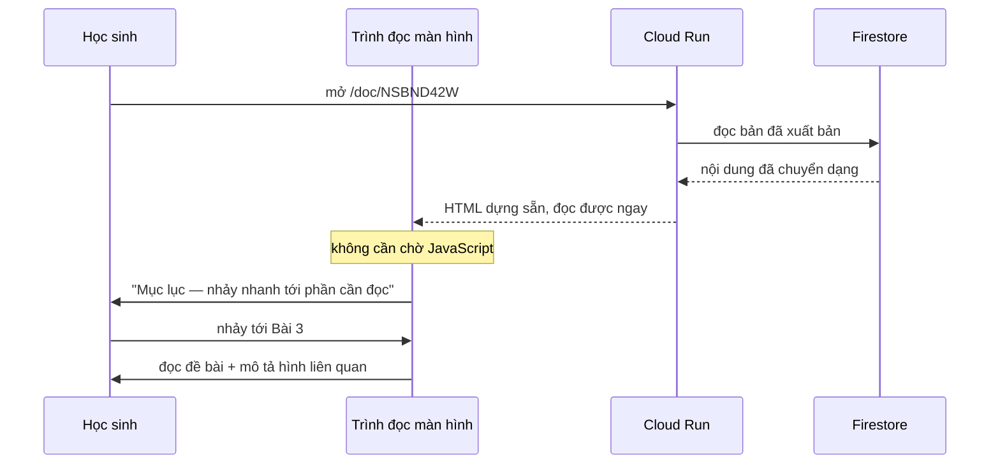

# Luồng chạy

Từ một trang sách giấy tới tai học sinh khiếm thị.

---

## Toàn cảnh



---

## Phía giáo viên — bốn bước

### Bước 1 · Thông tin tài liệu

Tên tài liệu, **môn học**, lớp, nguồn sách, người chuyển đổi.

Môn học không phải để hiển thị. Nó **đổi hẳn cách Gemini đọc trang**: sách Toán cần mô tả
hình học và đọc công thức; sách Ngữ văn cần giữ nguyên dòng thơ và gắn chú thích vào đúng
từ. Chọn sai môn thì chất lượng tụt rõ rệt.

### Bước 2 · Tải trang lên

Chọn nhiều ảnh một lúc. Trước khi gửi, ảnh được **nén về cạnh 1800px** ngay trong trình duyệt
— ảnh 4000px không đọc rõ hơn, chỉ chậm và tốn token.

Các trang xử lý **tuần tự, không song song**. Mỗi trang là một lượt gọi model khá nặng; bắn
cùng lúc dễ chạm hạn mức và mất luôn cả loạt. Trang nào hỏng chỉ mình nó hỏng, có báo tên tệp.

### Bước 3 · Duyệt — bước quan trọng nhất

Verso tự đánh dấu phần nó không chắc. Giáo viên chỉ cần xem đúng những chỗ đó.

Mặc định bật **"Chỉ hiện phần cần kiểm"**, vì bắt giáo viên đọc lại 13 khối khi chỉ 3 khối
đáng ngờ là cách nhanh nhất để họ bỏ ngang.

### Bước 4 · Xuất bản

Nhận **mã chia sẻ 8 ký tự** — bỏ các chữ dễ đọc nhầm (`0/O`, `1/I/l`), đủ ngắn để **đọc qua
điện thoại cho đồng nghiệp**, đủ dài để không dò ra được.

---

## Cổng duyệt: vì sao chặn ở máy chủ chứ không chỉ ẩn nút

Học sinh khiếm thị **không có cách nào tự đối chiếu với sách gốc**. Một lỗi chính tả trong
đoạn văn thì đọc lên là thấy ngợ. Nhưng **mô tả sai một cạnh tam giác**, hay **đọc sai một dấu
trong công thức**, thì các em cứ thế học theo — và không ai biết.

Nên chốt chặn nằm ở máy chủ:

```ts
const conLai = demChuaDuyet(ban.trang);
if (conLai > 0) {
  return NextResponse.json({ loi: 'CON_KHOI_CHUA_DUYET', soKhoi: conLai }, { status: 409 });
}
```

### Khối nào bắt buộc duyệt

```ts
daDuyet:
  loai === 'hinh-anh' || loai === 'cong-thuc' || !!tho.vanBanDoc
    ? false                    // luôn phải qua mắt giáo viên
    : doTinCay === 'cao',      // các loại khác: tin model khi model tự tin
```

Ban đầu tôi chỉ bắt duyệt khi model gắn cờ. Nhưng chạy thử thấy Gemini trả về **toàn bộ khối
đều "tin cậy cao"** — giáo viên không phải duyệt gì, bấm xuất bản thẳng.

**Model tự tin không có nghĩa là model đúng.** Nên hình vẽ, công thức, và câu văn có ký hiệu
toán *luôn* phải qua mắt người, bất kể độ tin cậy. Thực tế: trang 13 khối thì đúng 3 khối bắt
duyệt — đủ để chặn chỗ nguy hiểm mà không bắt tick 13 ô.

---

## Phía học sinh

Mở link. Hết. Không cài gì, không đăng ký, không tài khoản.



Thầy cô giao *"làm bài 3"* thì các em nhảy thẳng tới bài 3 từ mục lục, không phải nghe lại
từ đầu trang. Đó là thứ một file MP3 không làm được.

---

## Bên dưới mỗi bước chạy gì

| Bước | Chạy ở đâu | Gọi AI? |
|---|---|---|
| Điền thông tin | trình duyệt · localStorage | không |
| Nén ảnh | trình duyệt · canvas | không |
| Đọc trang | máy chủ · `/api/read-page` | **có** — Gemini multimodal + `responseSchema` |
| Duyệt, sửa | trình duyệt · localStorage | không |
| Xuất bản | máy chủ · `/api/publish` | không — chỉ kiểm tra và ghi Firestore |
| Học sinh đọc | máy chủ dựng sẵn | không |

Chỉ **một** bước tốn lượt gọi model. Mọi thứ khác miễn phí và tức thì.

---

## Bản nháp nằm ở máy giáo viên

Trong lúc soạn, toàn bộ nằm trong `localStorage` — kể cả ảnh trang sách. Chưa có gì lên
máy chủ cho tới khi bấm xuất bản.

Khi `localStorage` đầy (ảnh trang sách khá nặng), lớp lưu trữ **bỏ ảnh xem lại và giữ nội
dung**: thà mất ảnh đối chiếu còn hơn mất công chuyển đổi.

Lúc xuất bản, `bocAnhGoc()` **xoá hẳn ảnh scan** trước khi ghi Firestore. Điều 25a cho phép
tạo và phân phối **bản tiếp cận được**, không phải phát tán lại bản scan nguyên trang.

---

## Khi có lỗi

Route handler không bao giờ trả nguyên văn lỗi model ra ngoài.

| Mã | HTTP | Người dùng thấy |
|---|---:|---|
| `THIEU_KHOA_API` | 503 | "Máy chủ chưa được cấp khoá Gemini hợp lệ…" |
| `HET_QUOTA` | 429 | "Hôm nay đã dùng hết lượt đọc miễn phí…" |
| `BI_CHAN` | 422 | "Nội dung trang này chưa xử lý được…" |
| `QUA_LON` | 413 | "Tài liệu quá lớn… hãy tách thành nhiều chương" |
| `CON_KHOI_CHUA_DUYET` | 409 | "Còn phần chưa được duyệt…" |
| `LOI_MODEL` | 502 | "Chưa đọc được lúc này…" |

### Lỗi tạm thời được tự thử lại

Đo thực tế trên Cloud Run: khoảng **1/3 số lượt** gọi Gemini trả `503 Deadline expired` rồi
lượt sau lại chạy bình thường. Giáo viên tải 20 trang mà mất 7 trang là không dùng được.

```
lỗi tạm thời  → thử lại: 800ms → 1,6s → 3,2s (kèm nhiễu ngẫu nhiên)
lỗi thật      → ném ra ngay (API_KEY, SAFETY, PERMISSION…)
```

Sau khi thêm: **6/6 lượt thành công** trên production.
