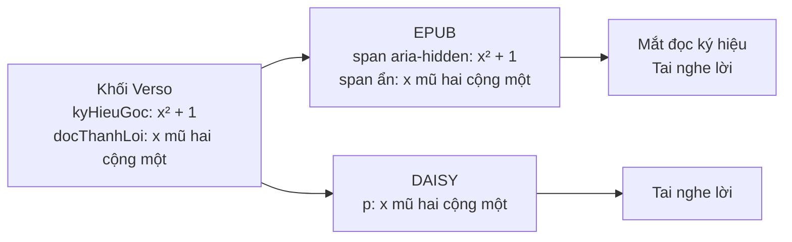

# Xuất file — EPUB 3 và DAISY 3

Trang web chỉ đọc được khi có mạng. Học sinh khiếm thị Việt Nam thì **đã có sẵn**
máy đọc DAISY và trình đọc màn hình NVDA. Đưa được bản chuyển đổi vào đúng công cụ
các em đang dùng nghĩa là **không phải học lại gì cả** — và đọc được cả khi nhà mất mạng.

```
GET /api/tai-ve/{maChiaSe}?dang=epub          → .epub
GET /api/tai-ve/{maChiaSe}?dang=daisy         → .zip (DAISY 3, chỉ có chữ)
GET /api/tai-ve/{maChiaSe}?dang=daisy-tieng   → .zip (DAISY 3 đầy đủ CÓ TIẾNG)
```

---

## Hai định dạng khác nhau ở chỗ nào

Đây là quyết định thiết kế đáng chú ý nhất của phần này.

Verso lưu **hai dạng** cho mỗi ký hiệu: dạng **hiện ra** (`x² + 1`) và dạng **đọc thành lời**
(`x mũ hai cộng một`). Hai định dạng xuất xử lý cặp đó ngược nhau, vì đối tượng đọc khác nhau.

| | EPUB 3 | DAISY 3 |
|---|---|---|
| Người đọc | cả người sáng mắt lẫn trình đọc màn hình | **chỉ để nghe** |
| Ký hiệu | giữ, đặt `aria-hidden="true"` | **bỏ** |
| Dạng đọc | ẩn khỏi mắt, trình đọc màn hình vẫn đọc | **chính là văn bản** |
| Mô tả hình | `<figure>` + `<figcaption>` | `<prodnote render="required">` |
| Số trang sách giấy | không | **`<pagenum>` + `pageList`** |

Vì sao DAISY phải bỏ ký hiệu: DTBook **không có `aria-hidden`**. Giữ cả hai thì máy đọc
sẽ đọc liền nhau — *"x mũ hai cộng một, x bình phương cộng một"* — nghe thành lắp bắp.



## Vì sao DAISY giữ số trang sách giấy

Thầy cô nói *"mở trang 71"*. Nếu bản đọc không có số trang giấy thì học sinh khiếm thị
không có cách nào theo được cả lớp.

DTBook có `<pagenum>` và NCX có `<pageList>` đúng cho việc này — máy đọc DAISY có sẵn
nút "nhảy tới trang số…". Số trang lấy từ chính ảnh trang sách mà Gemini đọc được.

Chỗ dễ sai: trang mới thường bắt đầu **đúng ở một đề mục**, mà đề mục thì thành `<level>`
chứ không phải khối nội dung — nên phải tra riêng, nếu không mất hẳn số trang đó
(`lib/xuat/daisy.ts`).

---

## Neo phải duy nhất trong cả tài liệu

Sách thật đánh số lặp lại liên tục: **mỗi bài học đều có "Luyện tập 2", "Ví dụ 3"**, và
chú thích đánh lại từ `(1)` ở **mỗi trang**.

Để trùng `id` thì mục lục nhảy về chỗ trùng tên **đầu tiên** — học sinh bấm "Luyện tập 2"
ở bài 3 lại rơi về bài 1, mà không có cách nào biết mình đang ở đâu.

`lib/neo.ts` tính một bảng neo cho cả tài liệu, dùng chung cho **cả ba** nơi dựng nội dung
(trang web, EPUB, DAISY) nên ba nơi luôn khớp nhau:

- bài tập trùng số hiệu → thêm hậu tố đếm
- chú thích → kèm số trang: `chu-thich-t2-1`
- dấu `[chú thích 1]` trong bài trỏ tới chú thích **của chính trang đó**

Cùng chỗ đó sửa luôn nhãn mục lục: chỉ thêm chữ "Bài" khi số hiệu là số trần (`4.28`),
vì `"Ví dụ 2"` đã tự đọc thành tên rồi — trước đó thành *"Bài Ví dụ 2"*.

---

## Kiểm chứng

Không tự nhận là hợp chuẩn — có công cụ kiểm:

| Kiểm | Công cụ | Kết quả |
|---|---|---|
| EPUB 3 | `epubcheck` | *Everything is fine* — 0 lỗi, 0 cảnh báo |
| DTBook | `xmllint --valid` với DTD `dtbook-2005-3` của NISO | hợp lệ |
| NCX | `xmllint --valid` với DTD `ncx-2005-1` của NISO | hợp lệ |
| Neo | đối chiếu mọi `href`/`idref` với `id` có thật | 0 liên kết hỏng |

Chạy trên **cả mẫu tự dựng lẫn trang sách thật đã chuyển đổi** — chính dữ liệu thật mới
lộ ra lỗi trùng neo ở trên.

---

## Vì sao tự viết bộ ghi ZIP

`lib/xuat/zip.ts`, khoảng 100 dòng, dùng `node:zlib` có sẵn.

EPUB có một ràng buộc mà đa số thư viện zip giấu đi: mục `mimetype` phải nằm **đầu tiên**
và lưu **không nén**. Sai là máy đọc sách từ chối cả file. Tự viết thì điều đó là một
tham số rõ ràng (`khongNen: true`), và bớt được một phụ thuộc.

---

## Giấy phép và phạm vi

DAISY là **chuẩn mở của NISO** (ANSI/NISO Z39.86), EPUB 3 là chuẩn mở của W3C.
Không có gì phải mua để đọc hay tạo hai định dạng này.

Mọi file xuất ra đều mang sẵn dòng miễn trừ: bản chuyển đổi **chỉ dành cho người khuyết tật
chữ in** theo Điều 25a Luật Sở hữu trí tuệ và Nghị định 17/2023/NĐ-CP. Ảnh trang sách gốc
**không** được đưa vào file xuất.
