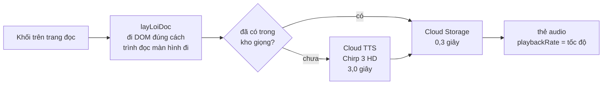

# Giọng đọc

## Vì sao không dùng giọng của trình duyệt

Bản đầu dùng **Web Speech API** — miễn phí, chạy ngay trên máy, không cần máy chủ.
Nghe thử thì phát hiện nó **đọc văn bản tiếng Việt bằng giọng tiếng Anh**.

Nguyên nhân không phải lỗi lập trình mà là bản chất của API đó:

```js
u.lang = 'vi-VN';        // chỉ là một GỢI Ý
u.voice = giongViet();   // null nếu máy không cài giọng tiếng Việt
```

Khi máy **không có giọng vi-VN**, `lang` bị bỏ qua và trình duyệt lấy **giọng mặc
định của hệ thống** — thường là tiếng Anh. Chrome trên Windows không cài gói ngôn
ngữ tiếng Việt rơi đúng vào trường hợp này, mà đó lại là cấu hình phổ biến nhất
trong phòng máy nhà trường.

Điều khiến lỗi này nghiêm trọng hơn bình thường: **người sáng mắt nghe là biết sai
ngay, còn học sinh khiếm thị thì không có cách nào biết.** Các em không đối chiếu
được với sách gốc — đó chính là lý do các em cần Verso.

Giao diện lúc đó còn khẳng định sai: nó chỉ kiểm `'speechSynthesis' in window` rồi
báo "đọc được", trong khi thứ đọc ra là giọng sai ngôn ngữ.

---

## Cách làm hiện tại

Giọng sinh ở **máy chủ** bằng Cloud Text-to-Speech, giọng `vi-VN-Chirp3-HD-Achernar`.
Tiếng Việt có **40 giọng riêng**, trong đó 30 giọng Chirp 3 HD — không phải giọng đa
ngữ đọc kèm tiếng Việt. Đổi giọng chỉ cần sửa `GIONG_DOC` trong `lib/constants.ts`.



### Cache là bắt buộc, không phải tối ưu thêm

Mỗi đoạn lưu theo **mã băm của chính nội dung** (`sha256(giọng + văn bản)`), nên mỗi
khối chỉ tổng hợp **một lần**, bao nhiêu học sinh nghe cũng vậy. Không có bước này,
một lượt nghe trọn tài liệu tốn gấp ba lần tiền chuyển đổi chính tài liệu đó.

### Vài chi tiết phải làm đúng

- **Trần 5.000 BYTE, không phải ký tự.** Tiếng Việt có dấu tốn gần 2 byte mỗi chữ,
  nên 3.000 ký tự đã có thể vượt. `catTheoByte` cắt theo byte ở ranh giới câu — cắt
  giữa câu làm giọng ngắt sai chỗ, nghe như đọc nhầm dấu chấm.
- **Chirp 3 HD không nhận `pitch`** (API trả lỗi thẳng), nhưng nhận `speakingRate`.
- **Tốc độ đổi ở trình duyệt** bằng `playbackRate`, không tổng hợp lại — một tệp đã
  lưu phục vụ cả bốn mức tốc độ.
- **Số hiệu lượt đọc thay cho cờ boolean.** Bấm "Phần sau" là dừng lượt cũ rồi mở
  lượt mới ngay; cờ bị đặt lại `false` trước khi vòng cũ kịp thấy, thành hai vòng
  chạy song song và phát chồng hai giọng.

---

## Sách Tiếng Anh: hai thứ tiếng trong một câu

Sách Tiếng Anh của Việt Nam **trộn hai thứ tiếng ngay trong một câu**: lệnh bài bằng
tiếng Việt, đoạn hội thoại bằng tiếng Anh. Một giọng đọc cả câu là sai ở nửa này hoặc
nửa kia — đúng lại lỗi cũ nhưng ngược chiều.

Và đây **không chỉ là chuyện giọng đọc của Verso**: trình đọc màn hình đổi bộ phát âm
theo thuộc tính `lang`. Thiếu nó, NVDA đọc "Hello, how are you" bằng âm tiếng Việt —
học sinh học phát âm sai mà không có cách nào biết. Đó là **WCAG 3.1.2 Ngôn ngữ của
từng phần, mức AA**.

### Đã thử thẻ SSML `<lang>` — không dùng được

Cloud TTS **nhận** `<lang xml:lang="en-US">` mà không báo lỗi, nhưng **không đổi cách
phát âm**. Đo bằng thời lượng: cùng một câu trộn, có thẻ và không thẻ đều ra đúng
**5,69 giây**, không lệch một phần nghìn giây. Trong khi cùng câu tiếng Anh đó đọc bằng
giọng Anh thật chỉ mất 1,85 giây so với 2,42 giây bằng giọng Việt.

Nên phải **tách thật rồi tổng hợp từng đoạn bằng giọng của nó** (`lib/nnu.ts`), rồi nối
lại — chỗ này dùng luôn cách nối MP3 đã có sẵn cho phần cắt theo byte.

### Đánh dấu ở đâu

| Cấp | Cách đánh dấu | Ai dùng |
|---|---|---|
| Cả khối | `Khoi.ngonNgu = "en"` | `lang` / `xml:lang` trên thẻ bao |
| Đoạn xen trong câu | `[en] … [/en]` trong văn bản | `<span lang="en-US">` |
| Từng ô bảng | `[en] … [/en]` trong từng ô | `<span>` trong ô |

Ô bảng phải đánh dấu riêng vì **bảng từ vựng là thứ hay gặp nhất ở môn Tiếng Anh**:
cột từ tiếng Anh, cột nghĩa tiếng Việt, ngay cạnh nhau trong một hàng.

Trình nghe **đọc thuộc tính `lang` ngay từ DOM** chứ không đoán lại — đó đúng là thứ
trình đọc màn hình dùng, nên hai bên không bao giờ lệch nhau.

Câu dẫn của Verso ("Mô tả hình vẽ.", "Bài tập 3.") luôn là tiếng Việt, kể cả trong khối
tiếng Anh, nên được bọc `[vi] … [/vi]`.

### Giọng tiếng Anh

`en-US-Chirp3-HD-Achernar` — cùng "nhân vật" Achernar với giọng Việt, nên chuyển qua
lại nghe như **một người song ngữ**, không phải hai người thay phiên.

### Đổi cách đọc thì phải đổi luôn mã cache

`DOI_TIENG` trong `lib/tieng.server.ts` nằm trong mã băm. Không có nó, những đoạn sinh
ra **trước** khi có phần tách ngôn ngữ vẫn đọc "[en]" thành lời và sống sót qua mọi lần
deploy — đã gặp thật, một câu 95 ký tự phát ra 29 giây thay vì 9 giây.

---

## Nút nghe là công cụ tự kiểm

Trình nghe đọc **đúng thứ trình đọc màn hình đọc**, không phải thứ hiện trên màn
hình: bỏ qua mọi phần `aria-hidden` (ký hiệu dành cho mắt), lấy phần
`.chi-doc-man-hinh` (dạng đọc thành lời), và **tôn trọng `aria-label`** ở những phần
tử lấy tên từ nội dung.

Chỗ `aria-label` này từng sai: trình nghe đọc dấu chú thích thành một chữ **"một"**
trơ trọi giữa câu, trong khi NVDA đọc "Chú thích 1" — hai bên lệch nhau thì việc
"nghe thử để kiểm" mất hết ý nghĩa.

Nhưng chỉ áp cho liên kết, nút, `role="math"`, `role="img"`. Áp cho vùng chứa là
hỏng: `<div role="group" aria-label="Đoạn thơ">` chỉ **đặt tên** cho khổ thơ — áp
nhầm là nuốt trọn cả bài thơ, chỉ còn đọc hai chữ "Đoạn thơ".

## Không xướng đè lên chính giọng đang đọc

Bộ đếm "phần 4/28" **không** có `aria-live`. Nó đổi liên tục, để live thì trình đọc
màn hình xướng đè lên chính giọng đang phát. Chỉ những chuyển biến người nghe cần
biết mới vào vùng thông báo: *đang tạo giọng đọc, bắt đầu đọc, đã tạm dừng, đã đọc
hết trang* — và lỗi thì vào `role="alert"`.

## Khi không tạo được giọng

Nói thẳng là chưa tạo được và chỉ sang trình đọc màn hình sẵn có của máy. **Không
bao giờ** lặng lẽ lùi về giọng sai ngôn ngữ — đó chính là lỗi ban đầu.

---

Xem thêm: [Chi phí thật](CHI-PHI.md) · [Khả năng tiếp cận](ACCESSIBILITY.md)
